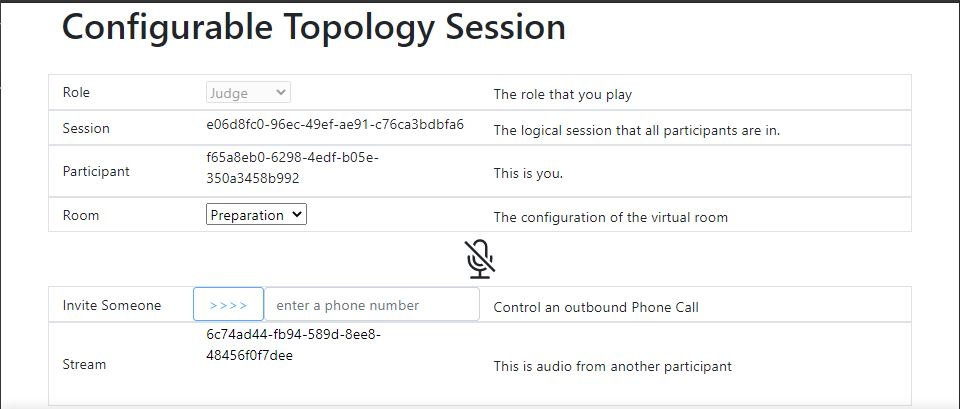

# warning - use at your own risk :-)

This demonstration app is the result of a prototype effort, and does not reflect Bandwidth release standards. Use at your own risk, and expect bugs.

# The configurable "courtroom" demo

This sample app takes a specialized scenario of a 'courtroom' environment that has 3 types of participants: the Judge, the Translator, and the Limited English Participant in the 'trial'. There are also multiple configurations for the virtual courtroom: each configuration has a different set of rule that govern which type of participant can hear (and thus speak to) the other types of participant. The Judge is the one that controls the configuration of the virtual room.

Each participant is represented by a browser page that exposes the participant's role, and the communication sessions that they have established to other users.



The page lists

- the Role that the web-page participant represents,
- the session that all participants belong to
- the participant's identity
- if the participant is a Judge, the configuration that the virtual room is in.
- a microphone that represents a local mute state - initially muted
- a field that allows the participant to add a phone-based participant
- a list of fields that represent the audio received from other participants.

## Setting things up

To run this sample, you'll need a Bandwidth phone number, Voice API credentials and WebRTC enabled for your account. Please check with your account manager to ensure you are provisioned for WebRTC.

This sample will need be publicly accessible to the internet in order for Bandwidth API callbacks to work properly. Otherwise you'll need a tool like [ngrok](https://ngrok.com) to provide access from Bandwidth API callbacks to localhost. Once ngrok is loaded the correct tunnel is established with the command ngrok https 5000.

### Create a Bandwidth Voice API application

Follow the steps in [How to Create a Voice API Application](https://support.bandwidth.com/hc/en-us/articles/360035060934-How-to-Create-a-Voice-API-Application-V2-) to create your Voice API appliation.

- In step 7 and 8, make sure they are set to POST.

- In step 9, provide the publicly accessible URL of your sample app. You need to add `/incomingCall` to the end of this URL in the Voice Application settings.

- You do no need to set a callback user id or password.

- Create the application and make note of your _Application ID_. You will provide this in the settings below.

### Configure your sample app

Copy the default configuration files

```bash
cp .env.default .env
```

Add your Bandwidth account settings to `.env`:

- ACCOUNT_ID=
- BAND_USERNAME=
- BAND_PASSWORD=

Add your Voice API application information:

- VOICE_APPLICATION_ID
- BASE_CALLBACK_URL
- FROM_NUMBER
- OUTBOUND_PHONE_NUMBER

You can ignore the other settings in the `.env.default` file.

### Install dependencies and build

From the main directory...

```
bash
cd ./frontend
npm install
npm run build

cd ../
npm install
npm start
```

### Communicate!

Browse to [http://localhost:5000](http://localhost:5000) and grant permission to use your microphone. For the sample application to work properly you will need to open multiple browser windows, all of which are connected to [http://localhost:5000](http://localhost:5000).

You should now be able to execute the actions described above The web UI will indicate when you are connected. The format of the telephone number includes a +1 followed by 10 digits.

Enjoy!
